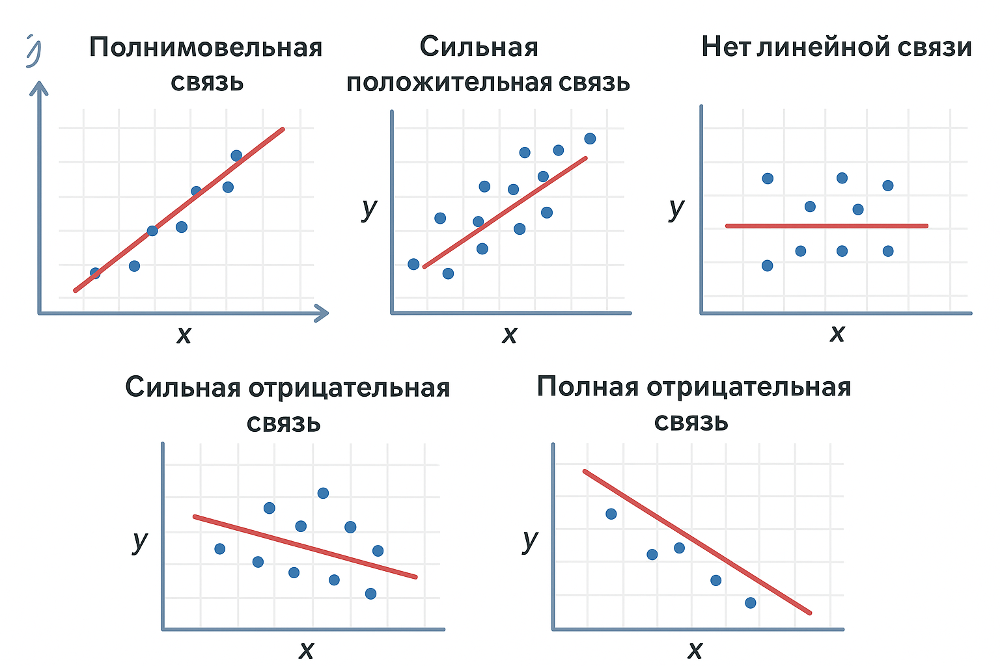

Мы уже с вами знаем, что в машинном обучении без данных никуда. **Статистика — это наука, которая изучает данные.**  
Но зачем нам это? Зачем нам работать с данными и как-то их анализировать?

Ты уже знаешь, что обычно признаков, по которым мы делаем предсказание, бывает много. И все эти признаки как-то влияют на результат. Но вопрос — **как именно они влияют?**

- Может, какой-то признак вообще неважен.
    
- Может, два признака одинаковые и дублируют друг друга.
    
- А может, один признак сильнее всех тянет результат в нужную сторону.
    

Чтобы это понять, нам нужно описывать данные: где их центр, как они разбросаны, связаны ли признаки друг с другом. Вот тут и приходит статистика.

**Статистика — это язык, на котором “говорят” данные.**  
Она помогает превратить кучу цифр в понятные характеристики:

- Среднее → рассказывает, где центр данных.
    
- Дисперсия → показывает, насколько данные разбросаны.
    
- Корреляция → отвечает на вопрос, связаны ли признаки между собой.
    

Именно с помощью статистики мы можем заглянуть внутрь данных, а не просто слепо кидать их в модель.

Давай подробнее рассмотрим для чего нам каждую из этих характеристик. 

Для чего нужно среднее?

У нас есть числа . Претположим температура за неделю

15, 18, 20, 22, 25, 30, 32 .  

Среднее = (15+18+20+22+25+30+32)/7 ≈ 23.  

Формула 

$$
\mathbb{E}[X] = \frac{\sum x_i}{n}
$$

#### Что это значит?

- Среднее — это **нормальное, типичное значение** для признака.
    
- Оно не говорит, какая температура **будет завтра**, но даёт **общий ориентир**, вокруг которого крутятся все остальные значения.

Окей мы знаем что такое срднее, а что такое **дисперсия?

Давай еще раз взглянем на нашу температуру

15, 18, 20, 22, 25, 30, 32 .  

При этом мы уже знаем что среднее равно 23. То есть средняя за неделю, общая.
Все наши числа  разные. Некоторые близко к 23, а некоторые — довольно далеко.

**Дисперсия** измеряет, **насколько сильно значения «разбросаны» вокруг среднего**.

А тут важный момент, у **дисперсии две формулы

Первая: **Дисперсия генеральной совокупности

$$
D = \frac{1}{n} \sum_{i=1}^{n} (x_i - \bar{x})^2
$$

N — количество объектов во всей совокупности (например, зарплаты всех жителей страны)

xi — отдельное наблюдение (например, зарплата конкретного человека).

xˉ — истинное среднее значение по всей совокупности (population mean).

Вторая: **Выборочная дисперсия

$$
s^2 = \frac{1}{n-1} \sum_{i=1}^{n} (x_i - \bar{x})^2
$$

- n — размер выборки (например, мы посмотрели зарплаты только 100 человек).
    
- xi— наблюдения внутри выборки.
    
- xˉ ˉ.— среднее значение внутри выборки (**sample mean**).

И чем первая отличается от второй??
Если у нас есть **вся популяция** (например, все жители Москвы и их зарплаты), то мы знаем «истинное среднее» xˉ. Тогда берём формулу с делением на N. 

Если у нас есть только **выборка** (например, зарплаты 100 случайных людей из Москвы), то мы не знаем «истинное среднее» xˉ. Мы считаем **оценку** — выборочное среднее xˉˉ.

НО,
прикол в том что многие ML- инжинеры праткически все, пользуются только дисперсией генеральной совокупности. Почему же ?

Ну во-первых на больших выборках разницы почти нет.  

Если у тебя миллион строк в CSV:

то 1/n и 1/n-1 -будут отличаться меньше чем   0.0001%

По сути эта даже не погрешность, тогда вопрос а когда мы все таки берем выборочную дисперсию? А когда данных мало. Условно 20 штук или меньше, не миллионы и не сотни тысяч. Еще выборочная дисперсия нужна для того что бы делать чисто **статистический анализ**, а не машинное обучение.  
(Например, проверяешь гипотезы, доверительные интервалы — там смещение критично).

Окей мы выйсняли что, среднее -определяет центр всех данных, дисперсия определяет как эти данные разброманы от среднего. Отсаеться только вопрос, а **зачем нам нужна дисперсия 

 Что значит «большая дисперсия»?

- Если дисперсия **большая** → данные сильно разбросаны вокруг среднего.  
    Пример: температуры за неделю
    
    - Город А: [19, 20, 21, 20, 19, 21, 20] → среднее 20, разброс маленький.
        
    - Город Б: [5, 15, 25, 35, 45, 10, 30] → среднее тоже 23, но разброс огромный.
        
	То есть в обоих случаях «центр» один, но стабильность разная.
    

Почему это важно в ML?

1. **Шум и надёжность признаков**
    
    - Маленькая дисперсия → признак «стабильный», можно доверять.
        
    - Большая дисперсия → признак «гуляет», модель труднее обучать.
        
2. **Сравнение признаков**  
    Представь:
    
    - Признак 1: рост (от 150 до 200 см).
        
    - Признак 2: возраст (от 10 до 100 лет).  
        Дисперсии разные → градиенты «скачут». Поэтому перед обучением мы делаем **нормализацию/стандартизацию**, чтобы дисперсии были сравнимы.

 

Итак мы поняли что такое дисперсия, но посмотри внимательно.Дисперсия измеряется в **квадратах единиц признака**. Например, если температура в °C, дисперсия будет в °C² — не очень удобно интерпретировать.

Здесь на помощь приходит **стандартное отклонение** — просто **квадратный корень из дисперсии**:

$$
\sigma = \sqrt{s^2} = \sqrt{\frac{1}{n-1} \sum_{i=1}^{n} (x_i - \bar{x})^2}
$$

- σ — показывает, **насколько в среднем значения отклоняются от среднего**.
    
- Например, если средняя температура за неделю = 23°C, а σ = 7°C → обычно температуры колеблются примерно ±7 градусов вокруг среднего.
    
 **Почему это важно:**

- Стандартное отклонение даёт более «человеческую» меру разброса, в тех же единицах, что и сам признак.
    
- Используется во многих формулах статистики и ML, например, при **стандартизации (Z-score)**:

То есть итог 
1. **Среднее** = «центр», «ожидание».
2.  **Дисперсия** = «насколько хаотично всё вокруг этого центра».
3. Большая дисперсия = данные непредсказуемые, маленькая = данные компактные и стабильные.
4. **Стандартное отклонение** - показывает меру разброса в тех еденицах которая она была 

### Корреляция

Что же такое корреляция ?

Корреляция показывает, **как два признака связаны между собой**.

- Если один растёт, а другой тоже растёт → положительная корреляция.
    
- Если один растёт, а другой падает → отрицательная корреляция.
    
- Если изменения одного никак не связаны с другим → корреляции почти нет.

Вообще для расчета кореляции есть много формул но мы остановимся на одной

$$
r = \frac{\sum_{i=1}^{n} (x_i - \bar{x})(y_i - \bar{y})}{\sqrt{\sum_{i=1}^{n} (x_i - \bar{x})^2 \sum_{i=1}^{n} (y_i - \bar{y})^2}}
$$

Что это все значит 

- xi, yi​ — значения признаков
    
- xˉ,yˉ​ — средние по признакам
    
То есть 
- Числитель — «как x и y изменяются вместе»
    
- Знаменатель — «масштабирование по разбросу»

| r          | Связь                       |
| ---------- | --------------------------- |
| 1          | Полная положительная связь  |
| 0.7–0.99   | Сильная положительная связь |
| 0          | Нет линейной связи          |
| -0.7–-0.99 | Сильная отрицательная связь |
| -1         | Полная отрицательная связь  |

### Зачем это нужно в ML?

1. **Понимание данных**

    - Смотрим, какие признаки влияют друг на друга.
        
2. **Отбор признаков**
    
    - Если два признака сильно коррелированы, можно оставить один → меньше шумов и меньше переобучения.
        
3. **Интерпретация модели**
    
    - После обучения модели можно смотреть на корреляцию между признаками и целевой переменной, чтобы понять «что важнее».

Окей, получается выйсняли, что такое корреляция, дисперсия и стандартное отклонение, 

Однако

Разные признаки измеряются в разных единицах и могут сильно отличаться по размеру чисел. Например рост в сантиметрах, возраст в годах, доход в тысячах рублей — их значения лежат в совершенно разных диапазонах. Если вспонить пример с мороженным то там была влажность, температур и реклама. И если температруа с влажностью еще лежат в одной группе то реклама абсолютно нет. Ее может быть как 1 так и 100. А темпертаура врядли когда нибудь будет равно 100 градусов.

Что же делать. Ведь по сути эта проблема. Если мы просто кинем все это в модель, признаки с большим разбросом будут **доминировать**, а маленькие почти не влиять.

Здесь на помощь приходят **нормализация и стандартизация** — способы привести признаки к сопоставимому масштабу.

### Нормализация (Min-Max scaling)

Идея: сжать все значения в диапазон 0–1.

$$
x_{\text{norm}} = \frac{x - x_{\min}}{x_{\max} - x_{\min}}
$$

Пример: рост 150–200 см → после нормализации:

- 150 → 0
    
- 200 → 1
    
- 175 → 0.5
    
Используется для алгоритмов, чувствительных к масштабу признаков (нейросети, k-NN).

### Стандартизация 

Идея: «сдвинуть» данные так, чтобы среднее стало 0, а разброс — 1 стандартное отклонение.

Что это значит
**Среднее значение становится 0** → это как «новая точка отсчёта». Всё измеряется относительно среднего.
    
**Разброс (стандартное отклонение) становится 1** → теперь мы можем сравнивать, насколько данные отклоняются от среднего в одинаковых «единицах».

$$
z = \frac{x - \mu}{\sigma}
$$

**Где:**
- $z$ — z-score (стандартизированное значение)
- $x$ — исходное значение
- $\mu$ — **среднее арифметическое** 
- $\sigma$ — стандартное отклонение (греческая "сигма")

