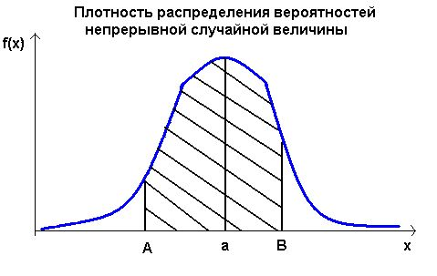

---

Дисклеймер: После того как я провела вам лекцию, я осознала, что дала вам интуитивное понимание, где это используется, но не дала вам самого важного. Вы споткнулись о слово **распределение**. Забавно то, что я вам неформально сказала определение данного термина. Но вы не поняли, и это норм. Давайте исправим это.

---

Забудем на минуту про машинное обучение и нейросети. Представь, что тебе, как и мне в свое время, нужно выбрать тему для диплома. Есть две идеи, и обе классные. И ты не можешь решить — какую взять. Как поступает настоящий инженер? Правильно, он дастенет монетку и скажет:

“Решка = тема №1, орёл = тема №2.”

Ты не знаешь, **что выпадет**. Но ты точно знаешь, **что может выпасть** — либо орёл, либо решка. Вот в этот момент мы с тобой сталкиваемся с **неопределённостью**. А чтобы описывать неопределённость, математика придумала язык — **вероятности**.

Каждый раз, когда ты подбрасываешь монетку, результат случаен. Но если ты подбрасываешь её **много раз**, ты начинаешь видеть закономерность.

Например: за 10 бросков монетки может выпасть 4 орла. За 100 подбрасываний выпадет 50 орлов, за 1000 — около 500.

Мы видим, что хотя каждый отдельный исход непредсказуем, но **частоты исходов** начинают подчиняться **определённой закономерности**. И вот эта закономерность — это и есть **распределение вероятностей**.

Что же вообще такое распределение? Распределение — это способ описать все возможные исходы случайного события и присвоить каждому из них вероятность.

Для монетки у тебя будут следующие исходы:

Решка = 0.5 Орел = 0.5

Отлично, теперь давай снова представим, что ты работаешь в Яндекс Еде. Работаешь там разработчиком (не курьером). И у нас есть наш любимый ресторан "Раки в Дону". У них добавилось новое меню, и нам надо предсказать, будет ли оно в принципе пользоваться спросом или нет.

Так как ты не курьер, а все-таки инженер, то скажешь, что для точного понимания надо провести эксперимент.

Мы возьмём 10 000 случайных пользователей в Ростове-на-Дону.

Разделим их на две группы:

**Группа A (контрольная) — видит старое приложение нового меню.

**Группа B (тестовая)** — видит новое меню “Раки в Дону”.
        

Итак, каждый пользователь в тестовой группе может сделать два исхода. Он может либо купить что-то из нового меню, либо не купить.

Задача такая же, что и с монеткой, только теперь вместо орла и решки есть купил/не купил.

Когда мы считали вероятность с монеткой, то было все просто. 1/2 = 0.5. Почему 1? Потому что суммарная вероятность всех возможных исходов всегда 1. Почему два? Потому что две стороны у монетки.

А как тут посчитать вероятность? Ведь заметь, шанс на покупку гораздо меньше. Он не всегда будет равен половине, как с монеткой. Вероятность, с которой мы будем работать, — число, которое было взято в ходе экспериментов, мы его не придумывали, а сделали статистическое наблюдение.

Для того чтобы эту вероятность взять, нам надо посмотреть прошлую статистику за 100 человек. Почему за 100? Ну, потому что это это по сути и есть наша 1 в монетке. Только теперь мы будем брать это дело в процентах. Смотри, мы с тобой посмотрели прошлую статистику и увидели, что похожее меню купили 5 человек из 100. Как посчитать вероятность? Верно, мы берем 5/100 = 0.05. Вот мы получили нашу вероятность, которую мы будем брать в нашей задаче. Если бы мы посмотрели и увидели, что похожее меню покупали 20 человек из 100, то мы бы 20 делили на 100. Если бы 40, то 40 делили на 100.

Отлично, мы с тобой знаем, что вероятность успеха того, что наше новое меню будут покупать, будет 0.05. Высчитали мы это, взяв прошлую статистику с похожим меню.

Отлично. У нас есть веротяность 0.05 у нас есть люди 10 000. ЧТо длеаем дальше ? 

А дальше мы задаемся вопросом 

А что вообще может произойти, если мы покажем это меню всем этим 10 000 людям?

- Некоторые купят, некоторые нет.  
- Кто-то посмотрит, но не нажмёт.  
- Кто-то добавит в корзину и передумает.

Но нас интересует одно:

- Сколько **в итоге** людей совершат покупку?

Если бы мы каждый раз выбирали 10 000, случайных пользоватлей то результат отличался бы 

В первом эксперементе купило бы 480 человек

Во втором 520

В третьем бы 498

И это все происходило при однйо веротяности

И вот тут нам на помощь приходит математическое ожидание. Матожидание говорит нам: **Сколько в среднем мы ожидаем успехов, если повторим эксперимент очень-очень много раз.**

Считается это по следующей формуле:
$$
E(X) = n \cdot p = 10{,}000 \cdot 0.05 = 500
$$
Это не значит, что **всегда** купят ровно 500 человек.

Это значит, что **если бы мы проводили эксперимент тысячу раз**, каждый раз считали, сколько человек купило, а потом взяли среднее — то это среднее было бы примерно **500**.

Если мы подбрасываем монетку 100 раз,  
мы ожидаем примерно 50 орлов и 50 решек.  
Не ровно 50 и 50 — может быть 48 и 52, или 51 и 49,  
но **в среднем** всё равно около 50. Так вот “50” — это и есть **математическое ожидание**.

Отлично, мы знаем, сколько в среднем людей может купить наше меню, знаем вероятность того, сколько человек покупали похожее, и знаем то, что наше новое меню видят 10к людей.

Мы с тобой нашли математическое ожидание, оно же среднее. Но ведь как мы с тобой поняли, что не всегда купят ровно 500. Покупок может быть 468, 390 и т.д. Следовательно, мы должны с тобой найти **насколько результат отклонен от среднего**. И мы знаем, как это делать, из прошлого урока. Мы с тобой такое проходили, чтобы найти разброс от среднего, нам надо использовать **дисперсию**.

Формула для нашей задачи будет следующая:

$$
\sigma^2 = n \cdot p \cdot (1 - p) = n \cdot p \cdot q
$$
---

P.S: Так кто-нибудь должен меня тегнуть в пятницу. По идее, я закончу с формулой TF-IDF, и дисперсия биномиальная уже валяется в айпаде. Надо будет аккуратно это все вам перенести.

---

Давай подставим

$$
\sigma^2 = 10{,}000 \cdot 0.05 \cdot (1 - 0.05) = 475
$$

На прошлом уроке мы с тобой говорили про стандартное отклонение, когда ищем дисперсию в тех единицах, которые нам нужны. Для того чтобы это сделать, надо просто дисперсию возвести под корень:

$$
sqrt(475)= 22
$$
sqrt -корень 

что в итоге 

Среднее (мат. ожидание) = 500

Разброс (стандартное отклонение) ≈ 22

Это значит, что **в большинстве экспериментов** результат будет где-то **между 478 и 522 покупками**.

Если вдруг получилось 580 покупок,  это уже значительно выше ожидаемого - значит, что-то реально изменилось (например, меню работает лучше, чем обычно, его заказло больше людей).

То что я сейчас вам показал называеться биноминальнвм распредлением. Как ее определить.

Есть фиксированное число испытаний n (у нас 10 000 пользователей).

Каждый результат — **независимый** от других (решение одного пользователя не влияет на другого).

У каждого испытания есть **два возможных исхода**: успех (купил) или неудача (не купил).

 Вероятность успеха p одинаковая для всех испытаний (0.05 в нашем случае).

Так звучал вопрос на паре, что если вероятностей не две, а три или четыре. Вопрос хороший, и да, такое бывает, для этого мы используем мультиномиальное распределение (multinomial distribution) — это обобщение биномиального на k>2 исходов.

Оно считает вероятность того, что каждый исход произойдёт определённое количество раз.

Например: из 10 000 заказов 4 000 выбрали чай, 3 000 кофе, 2 000 сок и 1 000 воду.

То есть **биномиальное = частный случай мультиномиального**, когда всего два исхода.

Подведем небольшой итог.

Что нам вообще дает распределение?

Распределение позволяет **предсказывать вероятности**, оценивать риски и принимать решения на данных.

Вот то, что мы с тобой рассмотрели, входит в класс дискретных распределений — события считаются **целыми числами** (сколько человек купило, сколько орлов выпало). Каждое значение имеет определённую вероятность

У нас есть еще непрерывное распределение. Что это за зверь такой?

В жизни не всё так дискретно.  
Иногда нас интересует не _сколько раз_, а _насколько сильно_, _насколько быстро_, _насколько долго_.  
То есть — величины, которые могут принимать любое значение в некотором диапазоне.

Представь, что ты курируешь логистику в том же Яндекс Еде.  Курьеры развозят заказы по Ростову.  Ты хочешь узнать: сколько времени занимает доставка?

Ты начинаешь собирать данные:

- кому-то привезли за 21 минуту,
    
- кому-то за 24,
    
- кому-то за 18,
    
- кому-то за 19.5,
    
- а кто-то живёт в частном секторе и ждал 31 минуту.

И вот тут интересно:  время — это **не целое число**.  Оно может быть **21.1**, **21.2**, **21.23** минут и так далее.  Нельзя перечислить все возможные значения — их бесконечно много.

Тут мы и переходим от **дискретных** распределений к **непрерывным**.

В дискретном случае мы говорим:

 вероятность того, что выпадет ровно 3 орла = 0.12

А в непрерывном случае так сказать нельзя.  Вероятность того, что доставка заняла _ровно_ 21 минуту — практически **0**.  Зато мы можем сказать:

 вероятность того, что доставка будет от 20 до 25 минут.

Вот так и работает непрерывное распределение:  
мы не считаем отдельные значения, а смотрим на **диапазоны**.

Чтобы описывать такие распределения, математики придумали не таблицу, а **функцию** —  её называют **плотностью вероятности** (probability density function, PDF).

Эта функция показывает, где чаще встречаются значения, а где — реже.

Если ты нарисуешь график плотности времени доставки, то получишь что-то вроде **горба**:

в центре — пик (например, большинство заказов приходят за 22 минуты);

по краям — хвосты (редко, но бывает, что заказ приехал за 15 или 35 минут).

На сцену выходит **нормальное распределение** 

Если ты измеришь:

- рост людей,
    
- вес котиков,
    
- время доставки,
    
- погрешности сенсоров,
    

почти всегда получится **та самая колоколообразная кривая**.

Она показывает, что:

- большинство значений сосредоточено **вокруг среднего** (мат. ожидания),
    
- чем дальше от среднего — тем реже встречается.
    

---

#### Интресный факт

Кстати, если ты вспомнишь наш пример с покупками меню “Раки в Дону”,  
там мы говорили: “в среднем 500 покупок, разброс примерно 22”.

Если количество пользователей огромное,  биномиальное распределение **становится очень похожим** на нормальное

Это даже называется **приближение нормальным распределением**.  
Именно поэтому в реальной аналитике мы часто используем нормальное распределение 

---

### Математическая форма

Формула плотности нормального распределения выглядит страшновато,  
но на деле в ней всё то же, что мы уже знаем: среднее и разброс.

$$
f(x) = \frac{1}{\sigma \sqrt{2\pi}} e^{ -\frac{(x - \mu)^2}{2\sigma^2} }
$$

Часть 1: Нормировочная константа `(1 / (σ √(2π)))`

 **Зачем она нужна?** 
 Чтобы общая площадь под всей кривой (от -∞ до +∞) была равна 1, то есть 100%. Это фундаментальное свойство распределения вероятностей.

**Что в ней важно?**
`σ` (стандартное отклонение). Чем больше `σ` (шире разброс), тем ниже и распластаннее будет кривая, чтобы площадь оставалась равной 1. Эта часть просто подстраивает высоту кривой под наш конкретный разброс.

Часть 2: Ядро экспоненты `e^( −(x − μ)² / (2σ²) )`

Это **самая главная часть формулы**, которая и задает ту самую горбатую форму.

`(x − μ)`: Это отклонение конкретной точки `x` от среднего значения `μ`.

 Если `x = μ` (попали ровно в среднее), то эта скобка равна 0.

`(x − μ)²`: Возводим отклонение в квадрат. Это убирает знак (нам все равно, влево или вправо отклонилось значение) и усиливает влияние больших отклонений.

`(x − μ)² / (2σ²)`:  Мы нормируем квадрат отклонения на дисперсию (`σ²`).

Минус перед дробью `- ...` : Экспонента `e^y` растет очень быстро. Чтобы она не росла, а убывала (и давала нам горб), мы берем отрицательное значение.

`e^( ... )`: Экспонента —  обеспечивает плавный, быстрый спад вероятности по мере удаления от среднего, но при этом вероятность никогда не становится равной нулю.   

**Вся сложная формула нужна всего лишь для того, чтобы превратить два простых параметра — `μ` (центр) и `σ` (ширину) — в красивый, плавный колокол, где:**

- Значения возле среднего — самые частые и вероятные.

- Значения дальше от среднего — всё менее вероятны.

- Скорость, с которой вероятность убывает, зависит от `σ`.

### Итого:

**Дискретные распределения** — считаем  сколько раз что-то произошло

 **Непрерывные распределения** — описываем  как значения распределены по диапазону 

